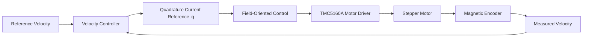

# System Architecture

## Overview

The TAS vehicle uses a Field-Oriented Control architecture with an outer velocity-control loop and an inner motor-current control loop.

This project focuses on improving the **outer velocity controller** while keeping the inner current-control structure unchanged.

---

## Controller Variants

Three alternatives were evaluated for the outer velocity controller:

- PI
- PID
- MPC

### PI Controller

The original controller combines proportional and integral feedback with output saturation and anti-windup.

It serves as the baseline for the project.

### PID Controller

The PID controller extends the PI structure by adding derivative action.

A low-pass filter is applied to the derivative term to reduce sensitivity to measurement noise.

The goal is to improve transient response and reduce overshoot and oscillations.

### Model Predictive Control

The MPC uses a discrete-time state-space model to predict the future speed response of the motor.

At every control step, it:

1. measures the current state,
2. predicts future behavior,
3. computes an optimal control sequence,
4. applies the first control action,
5. repeats the process at the next control step.

The controller balances tracking accuracy against control effort over a finite prediction horizon.

---

## Embedded Design Constraint

Unlike PI and PID, MPC depends strongly on:

- the quality of the internal motor model,
- the accuracy of physical parameters,
- and the computational resources available on the embedded platform.

These factors became important during the experimental evaluation.
