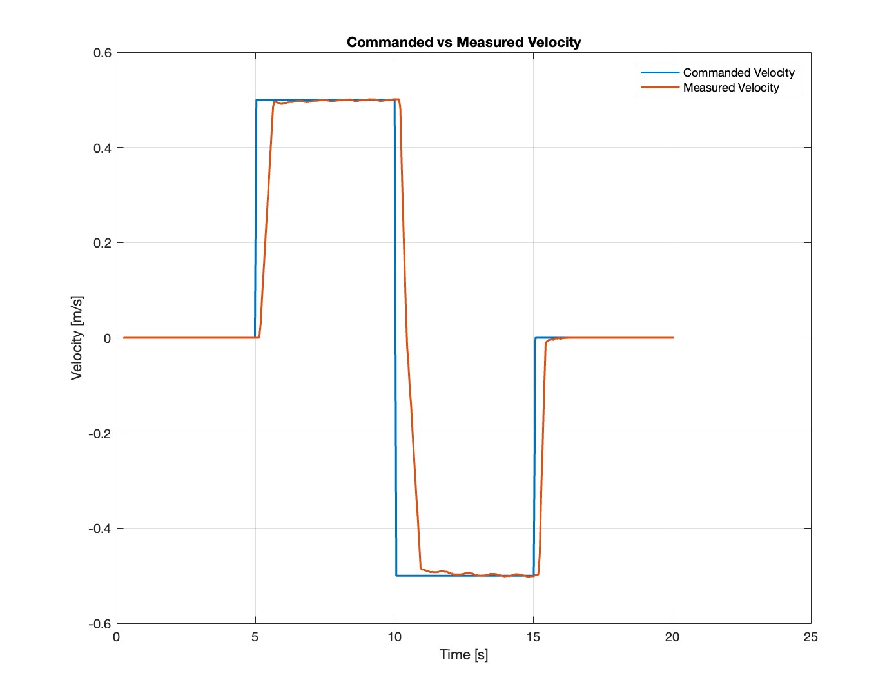
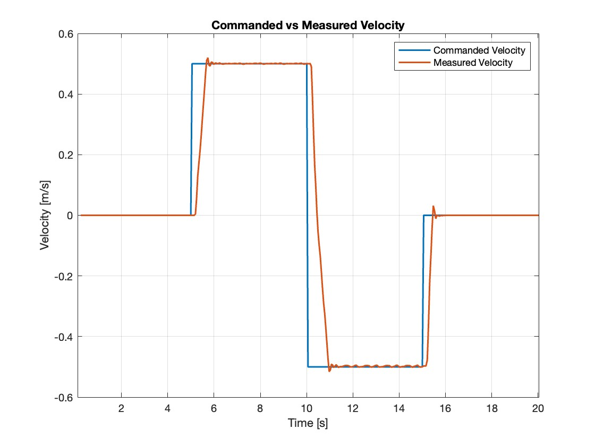

# Selected Figures

This folder contains a small selection of figures from the engineering project:

**Improvement of Motor Controller of the Small-scale Vehicles**

The figures are selected to show the main experimental progression of the project:

1. baseline PI performance,
2. improved PID response,
3. controller behavior under load torque,
4. MPC performance under nominal and disturbed conditions.

---

## Figure 1 — Baseline PI Velocity Control

**Based on:** Report Figure 1.2

[PI velocity control](PI.pdf)

### What the figure shows

This figure shows the original PI velocity controller tracking positive and negative reference velocities.

The response exhibits:

- noticeable overshoot,
- oscillations,
- and a small steady-state tracking error.

### Why it matters

This experiment establishes the baseline performance of the existing controller and motivates the investigation of PID and MPC as alternative velocity-control strategies.

---

## Figure 2 — PID Velocity Control

**Based on:** Report Figure 3.1

### What the figure shows

This figure shows the experimental response after replacing the original PI controller with the tuned PID controller.

Compared with the PI response, the PID controller produces:

- lower overshoot,
- significantly reduced oscillations,
- and smoother velocity tracking.

### Why it matters

The result demonstrates that relatively simple modifications to the classical controller can noticeably improve the transient behavior of the motor-control system.

---

## Figure 3 — Model Predictive Control Performance

**Based on:** Report Figure 3.3

### What the figure shows

This figure shows MPC performance under two conditions:

- nominal operation,
- operation with additional load torque.

Under nominal conditions, MPC achieves:

- very accurate velocity tracking,
- minimal overshoot,
- negligible oscillations,
- and fast settling.

When load torque is introduced, a steady-state tracking error appears.

### Why it matters

This result illustrates both the strength and the main limitation of the implemented MPC.

The predictive controller provides excellent performance when its internal model represents the system well, but becomes more sensitive when disturbances or parameter mismatch are present.

---

Together, the four figures summarize the main engineering result of the project:

> PID improves the original classical controller, while MPC provides the strongest nominal performance but introduces greater sensitivity to model accuracy, disturbances, and embedded implementation constraints.
